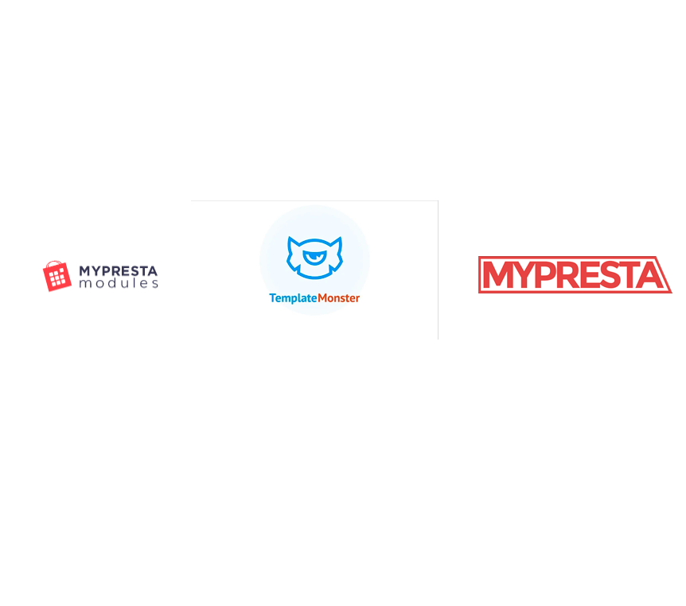

# PrestaShop Modules Collection

Recopilatorio de **módulos para PrestaShop 1.6 / 1.7** desarrollados y recopilados como referencia para el desarrollo de e-commerce. Este repositorio incluye más de 55 módulos organizados por categorías: desde módulos de blog y navegación hasta módulos de pago, envío y personalización de la tienda.

---

## Tabla de Contenidos

- [Sobre el Proyecto](#sobre-el-proyecto)
- [Catálogo de Módulos](#catálogo-de-módulos)
  - [Módulos JX (Template Monster)](#módulos-jx-template-monster)
  - [Módulos MPM (MyPresta)](#módulos-mpm-mypresta)
  - [Módulos Custom (My*)](#módulos-custom-my)
  - [Otros Módulos](#otros-módulos)
- [Estructura de un Módulo PrestaShop](#estructura-de-un-módulo-prestashop)
- [Modelo de Datos](#modelo-de-datos)
- [Requisitos](#requisitos)
- [Instalación](#instalación)
- [Hooks Principales](#hooks-principales)
- [Recursos](#recursos)
- [Autor](#autor)

---

## Sobre el Proyecto

PrestaShop es una plataforma de e-commerce open source que permite extender sus funcionalidades a través de módulos. Este repositorio agrupa módulos de diferentes fuentes y autores: módulos de la serie **JX** (Template Monster), módulos **MPM** (MyPresta), y módulos custom desarrollados como referencia y aprendizaje.

Cada módulo sigue la arquitectura estándar de PrestaShop: clase principal PHP, templates Smarty, controladores de administración, y archivos de configuración. Son compatibles con PrestaShop 1.6, 1.7 y algunos con 1.8.

---

## Catálogo de Módulos

### Módulos JX (Template Monster)

Módulos de la serie **JX** desarrollados por Template Monster. Proporcionan funcionalidades avanzadas para tiendas PrestaShop.

| Módulo | Descripción |
|---|---|
| `jxamp` | Páginas AMP (Accelerated Mobile Pages) para mejorar el rendimiento móvil |
| `jxblog` | Sistema de blog integrado en la tienda |
| `jxblogcomment` | Sistema de comentarios para los posts del blog |
| `jxblogpostposts` | Relación entre posts del blog (posts relacionados) |
| `jxblogpostproducts` | Vinculación de productos con posts del blog |
| `jxcategoryproducts` | Listado de productos por categoría personalizado |
| `jxcompareproduct` | Comparador de productos |
| `jxdaydeal` | Oferta del día con countdown timer |
| `jxfeaturedposts` | Posts destacados del blog |
| `jxgooglemap` | Integración de Google Maps |
| `jxheaderaccount` | Cuenta de usuario en la cabecera |
| `jxlookbook` | Lookbook / catálogo visual de productos |
| `jxmegalayout` | Sistema de mega layout para la tienda |
| `jxmegamenu` | Mega menú de navegación avanzado |
| `jxnewsletter` | Suscripción a newsletter |
| `jxoneclickorder` | Pedido en un solo clic (compra rápida) |
| `jxproductlistgallery` | Galería de imágenes en listado de productos |
| `jxproductzoomer` | Zoom de producto al pasar el ratón |
| `jxsearch` | Búsqueda avanzada de productos |
| `jxwishlist` | Lista de deseos / favoritos |

### Módulos MPM (MyPresta)

Módulos de la serie **MPM** (MyPresta Modules). Cubren funcionalidades de contenido, layout y personalización de la tienda.

| Módulo | Descripción |
|---|---|
| `mpm_blog` | Sistema de blog para la tienda |
| `mpm_brands` | Listado y gestión de marcas / fabricantes |
| `mpm_contactform` | Formulario de contacto personalizado |
| `mpm_customblock` | Bloques de contenido HTML personalizados |
| `mpm_customfeatured` | Productos destacados personalizados |
| `mpm_documentation` | Módulo de documentación interna |
| `mpm_footer` | Footer personalizable de la tienda |
| `mpm_header` | Header personalizable de la tienda |
| `mpm_homeblocks` | Bloques de contenido para la homepage |
| `mpm_homefeatured` | Productos destacados en la homepage |
| `mpm_homepage` | Configuración de la página de inicio |
| `mpm_homeslider` | Slider / carrusel de imágenes para la homepage |
| `mpm_imageslist` | Listado de imágenes configurable |
| `mpm_scrolltop` | Botón de scroll to top |
| `mpm_social_buttons` | Botones de redes sociales |
| `mpm_socialsharebuttons` | Botones para compartir en redes sociales |
| `mpm_subcategories` | Visualización de subcategorías |
| `mpm_suppliers` | Listado y gestión de proveedores |
| `mpm_testimonials` | Testimonios de clientes |
| `mpm_themeconfigurator` | Configurador visual del tema |
| `mpm_topmenu` | Menú superior de navegación |
| `mpm_viewproductlist` | Vista personalizada del listado de productos |

### Módulos Custom (My*)

Módulos propios y de ejemplo para aprendizaje del desarrollo de módulos PrestaShop.

| Módulo | Descripción |
|---|---|
| `myadminlink` | Enlace personalizado en el panel de administración |
| `myadminsololink` | Enlace único en el admin |
| `mycategory` | Gestión personalizada de categorías |
| `mycomments` | Sistema de comentarios |
| `myconfigurator` | Módulo configurador de ejemplo |
| `mymodcarrier` | Módulo de transportista / carrier personalizado |
| `mymodcomments` | Sistema de comentarios para productos |
| `mymodpayment` | Módulo de método de pago personalizado |
| `mypopup` | Ventana popup / modal configurable |
| `myreasurance` | Módulo de reassurance (garantías, envío gratis, etc.) |
| `myslider` | Slider de imágenes personalizado |

### Otros Módulos

| Módulo | Descripción |
|---|---|
| `appclient` | Módulo cliente de aplicación |
| `belvg_testimonials` | Testimonios de clientes (BelVG) |
| `client_prestashop` | Módulo de gestión de clientes |
| `cronjobs` | Gestión de tareas programadas (cron jobs) |
| `listproducts` | Listado de productos personalizado |
| `newfieldstut` | Tutorial de campos personalizados en entidades |
| `phpandfrhooksmanager` | Gestor de hooks PHP y Front |

---

## Estructura de un Módulo PrestaShop

Cada módulo sigue la estructura estándar de PrestaShop:

```
nombre_modulo/
├── nombre_modulo.php           # Clase principal del módulo (install, uninstall, hooks)
├── config.xml                  # Configuración del módulo (nombre, versión, autor)
├── logo.png                    # Icono del módulo (32x32)
├── controllers/
│   ├── admin/                  # Controladores de administración
│   └── front/                  # Controladores de front-office
├── classes/                    # Clases PHP del módulo (ObjectModel, etc.)
├── sql/                        # Scripts SQL (install.sql, uninstall.sql)
├── views/
│   ├── css/                    # Estilos CSS
│   ├── js/                     # Scripts JavaScript
│   └── templates/
│       ├── admin/              # Templates Smarty para el backoffice
│       ├── front/              # Templates Smarty para el frontoffice
│       └── hook/               # Templates para hooks específicos
├── translations/               # Archivos de traducción
└── upgrade/                    # Scripts de actualización entre versiones
```

---

## Modelo de Datos

El repositorio incluye un diagrama del modelo de datos de PrestaShop para referencia:



---

## Requisitos

- **PrestaShop** 1.6.x / 1.7.x / 1.8.x
- **PHP** >= 7.1
- **MySQL** >= 5.6 o MariaDB >= 10.1
- Acceso FTP o SSH al servidor (para instalación manual)

---

## Instalación

### Método 1: Desde el Back Office

1. Acceder al panel de administración de PrestaShop
2. Ir a **Módulos > Gestor de módulos**
3. Clic en **Subir un módulo**
4. Seleccionar el archivo `.zip` del módulo
5. PrestaShop instalará automáticamente el módulo

### Método 2: Instalación Manual (FTP)

1. **Clonar el repositorio**

```bash
git clone https://github.com/david-berruezo/prestashop-modules.git
```

2. **Copiar el módulo** deseado a la carpeta de módulos de PrestaShop

```bash
cp -r prestashop-modules/nombre_modulo /var/www/html/prestashop/modules/
```

3. **Establecer permisos** correctos

```bash
chmod -R 755 /var/www/html/prestashop/modules/nombre_modulo
chown -R www-data:www-data /var/www/html/prestashop/modules/nombre_modulo
```

4. **Activar** el módulo desde el Back Office en **Módulos > Gestor de módulos**

---

## Hooks Principales

Los módulos de PrestaShop se enganchan al sistema mediante **hooks**. Estos son los hooks más utilizados en los módulos de este repositorio:

| Hook | Tipo | Ubicación |
|---|---|---|
| `displayHeader` | Display | Cabecera HTML (`<head>`) |
| `displayTop` | Display | Parte superior de la página |
| `displayNav` | Display | Barra de navegación |
| `displayHome` | Display | Página de inicio |
| `displayFooter` | Display | Pie de página |
| `displayLeftColumn` | Display | Columna izquierda |
| `displayRightColumn` | Display | Columna derecha |
| `displayProductButtons` | Display | Botones en ficha de producto |
| `displayProductAdditionalInfo` | Display | Info adicional del producto |
| `displayBackOfficeHeader` | Display | Cabecera del Back Office |
| `actionProductAdd` | Action | Al añadir un producto |
| `actionProductUpdate` | Action | Al actualizar un producto |
| `actionOrderStatusUpdate` | Action | Al cambiar estado de un pedido |
| `actionCartSave` | Action | Al guardar el carrito |
| `actionPaymentConfirmation` | Action | Al confirmar un pago |

---

## Recursos

### Documentación Oficial

- [PrestaShop DevDocs](https://devdocs.prestashop-project.org/)
- [Crear un Módulo PrestaShop](https://devdocs.prestashop-project.org/8/modules/creation/)
- [Hooks Reference](https://devdocs.prestashop-project.org/8/modules/concepts/hooks/)
- [Clase ObjectModel](https://devdocs.prestashop-project.org/8/development/components/database/objectmodel/)
- [Clase Db](https://devdocs.prestashop-project.org/8/development/components/database/db/)

### Marketplace y Comunidad

- [PrestaShop Addons Marketplace](https://addons.prestashop.com/)
- [PrestaShop GitHub](https://github.com/PrestaShop/PrestaShop)
- [PrestaShop Forums](https://www.prestashop.com/forums/)

---

## Autor

**David Berruezo** — Software Engineer | Fullstack Developer

- GitHub: [@david-berruezo](https://github.com/david-berruezo)
- Website: [davidberruezo.com](https://www.davidberruezo.com)

#### 01.- Mypresta | Template monster | Mypresta modules<br>

	
